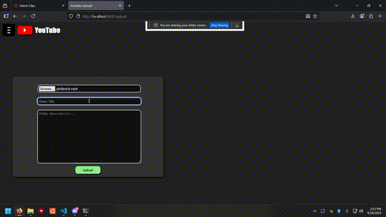
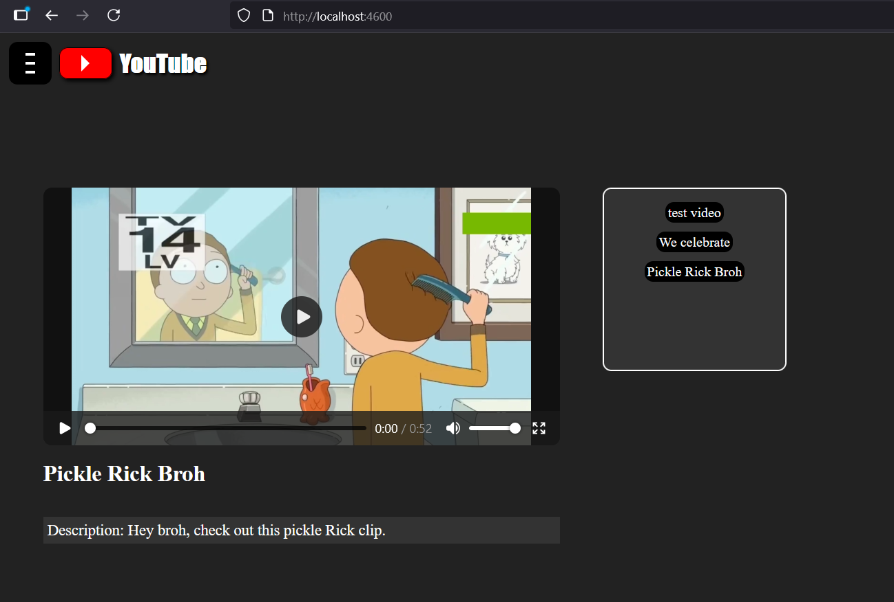

# Ytwebplayer

<br>

## Description
```
- Youtube clone project, but not as pretty.
- Upload and play video files from your computer
- RECOMMENDED PC usage, Looks horrid on mobile.
```
<br>




<br>

## Installation

```
- No installation needed, app hosted on render
```

## App link
[Ytwebplayer](https://ytwebplayer.onrender.com/)


<br>

```
- Frontend CSS/HTML/Javascript
- Backend Node.js/express
- Database Postgres
- Dependencies: express, cors, dotenv, multer, pg
- DevDependencies: nodemon, node-pg-migrate
```
<br>

---
### BloodLordSoth
[Github](http:github.com/BloodLordSoth) | [youtube](http://youtube.com/@bloodlordsoth)
